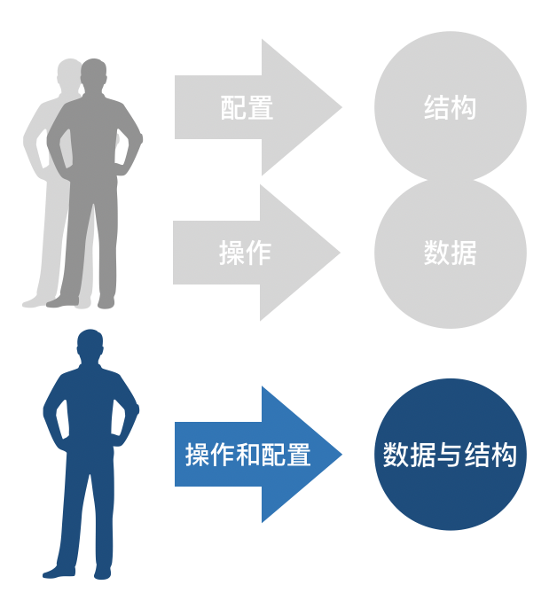

# 如何选择支持敏捷的电子协作工具

作者：王宇（ACT Leader）

> “We become what we behold. We shape our tools, and thereafter our tools shape us.” --Marshall McLuhan
>
> "我们定义工具，然后工具定义我们；我们定义机器，没准我们就是机器。"——马歇尔·麦克卢汉

## 工具的遐想

如果我说纸和笔是协作工具的鼻祖，估计没有人反对我的观点（有人反馈泥巴和树枝才是协作的鼻祖 ……我深深鞠躬）。你肯定会说如果纸和笔算是协作工具的话，桌子和椅子应该也算吧。

我不太好反驳你，这种工具（甚至是东西）基于林迪效应，估计会一直存在下去。估计只要有人这东西就会一直存在下去，天荒地老，海枯石烂。那什么是林迪效应呢？

> 林迪效应是指，对于一些不会自然消亡的东西，比如一种技术、一个想法，它们的预期寿命和它们目前已经存在的时间成正比。即它每多生存一段时间，它的剩余预期寿命就会增加一点。——维基百科

所以尽可能选择那些存在时间久的物理工具，因为这些工具可以存活更长的时间。但如果你问如果是敏捷电子协作工具的话该如何选择呢？

我们需要首先思考

## “敏捷”对工具有什么追求

说到敏捷对于工具的追求肯定要提及下面的内容：

> “个体和互动 高于 流程和工具” ——[敏捷软件开发宣言](https://agilemanifesto.org/iso/zhchs/manifesto.html)
> “Individuals and interactions over processes and tools”——[Manifesto for Agile Software Development](https://agilemanifesto.org/iso/en/manifesto.html)

一般对于这个的解释是：**我们认同流程和工具的价值，但更认同个体和互动的价值**。另一种解释是，**敏捷的流程和工具需要更好的支持个体和互动**。

对于如何能够更好的支持个体和互动的工具，我认为有一个非常重要的特征，这就是：

### 工具的适应性

纸和笔我一般认为这是一种“适应性”工具，什么是“适应性”工具呢？适应性工具如同其名字，是追求工具在不同场景下的适应性。纸与笔基本没有配置的需要，直接拿来就用，所见即所得。与纸和笔非常类似的“敏捷”工具是报事贴（sticky note），这种协作工具大量充斥在敏捷项目之中。如果把物理看板、白板甚至电子工具也认为为一种工具的话，这几个事物适应指数（已存在的时间）应该是：

* 纸和笔 > 报事贴 > 白板 > 物理看板 > 电子工具

其实报事贴与纸和笔的适应指数已经非常接近了。适应性程度同样可以理解为独立性（依赖少），纸不太依赖笔（我拿一块石头都能在纸上画出样子来），笔也不太依赖纸（我可以在桌子上花，也可以在墙上画）。适应性越差的工具往往依赖更多的事物，恰恰是更多的依赖，造成工具不能迅速且敏捷的支持“个体和互动”。

说到电子工具，你会解释说都是SaaS，有计算机就行，没有什么依赖啊。但我想说明的是任何的电子工具都对计算机造成了依赖，有的对网络造成了依赖，对输入法造成了依赖。甚至如果把计算机的硬件层、操作系统层、浏览器层逐一打开的话，你会发现任何的电子工具相比较物理工具都拥有更多的依赖。

对于电子工具我还没有谈及配置和定制部分。如果配置与定制需要另一个人才能操作，这就增加了更多的依赖关系。如果你之前做过开发工作的话，你应该能够想象得到如果某些模块依赖过多的话会有什么结果：系统脆弱（易产生缺陷），难以维护（逻辑复杂），不愿触碰（难以理解）。

如果你的敏捷团队在同一地点的话，你会非常习惯于报事贴、纸和笔、物理白版或墙。电子工具你会感觉非常的突兀和不合适。因为你不倾向让沟通的带宽因为拥有依赖的工具而降低。

#### 回到电子工具

如果说把常见电子工具的适应性进行排序的话将会是下面的顺序：

* 邮件系统（1981年SMTP协议发明） > Excel（1985年发明） > Wiki（1995年发明） > 团队可自行配置的工具 > 团队不可自行配置的工具（类似MIS或ERP）

邮件系统，本质是一个区块链的信息传递与责任确认系统。在这个系统之中，信息传递与责任确认 要高于 协作。Excel本质是一个结构化信息存放工具，顺便能产生一些图表。对于协作的话，可能就需要邮件系统的转发Excel了。但，邮件与Excel没有解决的一个关键问题就是，信息状态分散的问题。缺少基本的版本控制，举一个简单例子就是别人发给你的Excel表格，你改了改又发给其他人，大家只能认为最后发出的邮件中包含的附件是最新版本的内容。但是真实情况不一定是这样，邮件版本可能乱七八糟，Excel上的结构混乱不堪。邮件+Excel最大的问题在于太过灵活，每一个人都可以形成自己的一个信息状态的版本。

Wiki确实是因为协作而产生的工具，且是第一个极限编程项目c2诞生的工具。这点与团队可自行配置的一些工具有些相似之处，自行配置意味着可以完全控制这个工具的使用方向，并加以定制。比如可以定义看板的不同价值阶段，甚至给某些工具写插件进行更进一步的定制。

最后就是团队不可自行配置的工具，这些工具一般由专人进行配置。针对特定领域，如财务、软件项目管理、流程审批等等。这种工具的一大特点是具有**“管理”**特性，沉淀企业中的流程与数据，并使之电子化。MIS（Management Information System）这个概念早在主机时代就已经诞生，现在依旧存在。说到这个概念，就不得不说一下工具的防守性。

### 工具的定制性

企业运营的过程中存在着两个力，一个是让旧事物更为高效的力（管理力），另一个是让改变与新事物更容易产生的力（领导力）。对于角色的分工、流程的划分、工作的标准化这属于管理力的一种具体体现。这种思维从20世纪初的福特为开始，到基于戴明理论的全面质量管理（TQM）为鼎盛。这种力的趋势拥有一个假设，就是如果你没有一个好的过程的话，那如何拥有一个好的结果呢？这种思维倾向于工具的可定制属性。

有趣的是因为VUCA，不稳定"(Volatile)、"不确定"(Uncertain)、"复杂"(Complex)、和"模糊"(Ambiguous)已经在21世纪成为一种新常态，所以改变与新事物的力倾向这样的一种假设：你管什么过程啊，得到结果就好（黑猫白猫，抓到耗子就是好猫）。也正因为对领导力更为的重视，所以敏捷概念现在如火如荼的在各行各业扩展开来。这种思维倾向工具的适应性。

我们要承认这两种力的存在，这两种力对于企业演进的当下状态来说都具有价值。但我们需要明确的是，关注改变与创新的时候，同时要思考让旧有的事物更为高效。当我们思考让事物高效的时候，不要成为改变与创新的障碍。

切不可形成一套防守式的**“敏捷管理系统”**，单方面给团队设定一些所谓的流程和必填字段。这不是敏捷的工具，更不是敏捷的思路。这只不过是打着敏捷旗号的统治而已。给予团队工具和支持，与团队明确重要的节点与信息以及可能的影响。让团队可以犯错，并且也能够让团队自行修正这才是站在防守大陆上，迈向进攻状态的关键思路。

## 敏捷电子协作工具需要具备的特点

使用过很多电子工具之后，我非常明确有一些关注点，或是一种倾向。这些内容，可以成为你选择敏捷电子工具的一些考量方面。

### 1、看到的一切都是统一的（感知即真实）

团队在高频率与工具交互的过程需要一致的数据体验，不能有等几分钟再操作这种事情。信息需要透明统一、状态一致、结构清晰：

**操作与显示的即时性：**团队成员的操作，需要即时的在其他的计算机上进行展现。这样才有协作的意义，而不是在一台计算机上进行全部的操作，或是一台计算机操作完毕之后另一台计算机需要按刷新按钮才能进入下一步的操作。（团队成员在操作一个事物，更改一个状态）

**结构与冲突的直观性：**能够非常明显的表现出协作的关键点，而不是需要通过搜索和过滤才能查询到。对协作关键内容的要能够直观展现，能够迅速定位。一眼看出现在协作的重要事项、风险。（团队成员可以拥有不同层次的视图，调整自己的视角进行审视）

### 2、使用的过程配置就同时发生（使用即配置）

敏捷团队所期望的是不丧失防守特性的进攻武器。但本质上这应该是一件进攻性武器，进攻性武器就应该如同纸和笔一般，直观、有效、默认没有限制。团队需要工具配置发生调整的时候，可以及时调整不需要让其他人帮忙，甚至没有“配置”概念，一切配置都在使用中发生：

**使用的过程就是配置的过程：**团队中的任何人都可以更改配置。比如，增加字段、增加状态信息类型、删除（丢弃）数据甚至是字段。没有“设置”的菜单或是功能。

**配置信息的版本控制与记录保存：**正是因为配置的灵活与动态能力，所以需要针对配置信息的版本控制与记录保存。工具不光能够记录协作的最新状态，而且能够记录协作规则的演变过程。并查询（甚至是回滚）到某次协作的时间点，重新审视协作的关键流程或内容。

### 3、能够提示使用者数据的问题而不是禁止录入（管理即提醒）

团队需要管理信息的有效性，某些字段是必输入的，某些流程关键点是重要的。但工具应该能够允许灰色数据的输入，并进行提醒，甚至明确某个团队有多少个没有达到数据要求标准的输入内容。如同下图，之前数据输入之后，只有两种状态，一个是合规一个是不合规的两种状态。但是现在需要敏捷协作工具能够适应数据不合规的状态，并且对于日后可能设置的新数据规范能够对当前数据进行提醒（B阶段的状态）。

**数据输入与管理的松耦：**之前类似MIS系统不属于进攻工具的一个重要特性就是它对灰色数据的控制与管理。一般来说系统设计是不允许灰色数据的产生的，因为如果有灰色数据产生的话，数据关系无法清晰的进行描述。但恰恰是允许更多灰色数据的输入才能可以产生更多可能性。

**提醒而不是阻止：**对于数据来说，我们太习惯用减少多样性的方式来面对。但对于敏捷项目来说，多样性本身就存在无数可能。现在有效的不一定未来有效，如何能够实现管理目的，又能不僵化的控制信息输入。信息的输入应该像一个喇叭口一样，最后沉淀到有价值和结构的信息。而不是一上来就进行设置，当然一上来进行设置也是可以的，日后进行设置应该也没毛病。对于使用者来说，应该看到的是明确的提醒信息。

### 4、信息可以逐渐添加层次（信息即组合）

敏捷项目的某一个协作介入点，可能都是整体信息的一个片面，一个角度。如何能够使得协作数据逐渐**成长**成为拥有整体结构的信息，而不是一上来就想好整个信息的布局与结构。

**结构复杂、向上关联、向下关联的动态性：**任何一个信息的输入都应该可以进行横向扩展（结构复杂），比如增加更多的二维数据，增加类型，增加更多的字段。也可以与其他信息进行关联，成为其他信息或数据的儿子（上推）或父亲（下拉）。也就是说这样就是一种灵活的结构而不是一种僵化的结构。使得**“重构”**得以发生。

**数据重构能力：**任何信息都有其可能相关与相连的内容，这些关联内容不一定一开始就能够明确，如何能够通过信息与数据重构的手段使得更合适的结构得以发生。

### 5、对使用者的尊重（颜值即正义）

使用软件应该是愉悦的，起码可以让使用者感到了尊重。让使用者感觉是Ta在使用软件，而不是软件在使用自己。软件的颜值我认为基本分为视觉和交互两大部分：

**简洁的视觉感受：**协作工具其实是生产力工具的一部分，生产力工具第一个关键的特征是简洁的感受。简洁之后，可以让使用者的注意力关注到事物重点的内容，而不是提醒或结构信息。

**直接的交互感受**：任何的功能都应该是一个12岁的学生能够操作的范围，不应该有过多的培训和说明过程。更不能有反直觉的设计内容。比较让人欣慰的是大部分软件在这个领域已经不是短板了。

### 6、更换成本低（丢弃即丢弃）

什么是丢弃既丢弃呢？就是这个工具可以相对简单和舒适的离开团队，而不是一旦选用这个工具之后我们就无法离开这个工具。看到过一些场景，感觉企业是在被一些工具进行胁迫。这就会到了一管就死，一放就乱的管理两难境地。所以选择一个敏捷工具它是不是可以迅速的被丢弃，是非常重要的衡量指标。

系统一般有两种系统，一种系统是让你尽可能的陷入其中，另一种系统是让你尽可能的摆脱这个系统。对于传销来说就是就是前一种系统，而儿童养育的过程就是第二种系统。如果一个工具始终都希望你的数据停留在它的系统之中，不愿意随时迎接丢弃的命运。我认为这种工具也是一种防守型工具，它不适合敏捷的协作要求。

**有效的导出与导入功能：**一个随时可以丢弃的系统，需要有一个有效的导出和导入功能。这个功能要足够的好用，以至于可以用Excel或其他简单的工具进行替代。也恰恰是因为有这种功能的存在，数据的安全性也会提高一个档次。

### 总结
 1. **看到的一切都是统一的（感知即真实）**
    * **操作与显示的即时性**：一人操作其他机器即时展现；
    * **结构与冲突的直观性**：能够标明重点或打标签；
 2. **使用的过程配置就同时发生（使用即配置）**
    * **使用的过程就是配置的过程**：没有配置菜单（或基本用不到）；
    * **配置信息的版本控制与记录保存**：设置信息的版本化可回滚化；
 3. **能够提示使用者数据的问题而不是禁止录入（管理即提醒）**
    * **数据输入与管理的松耦**：能够输入不符合管理要求的数据，并能通过修改与调整进行修正；
    * **提醒而不是阻止**：提醒哪些内容与要求不相符；
 4. **信息可以逐渐添加层次（信息即组合）**
     * **结构复杂、向上关联、向下关联的动态性**：能够相互关联，并能扩展自己的结构。
     * **数据重构能力**：数据嫁接与重新定义结构能力；
 5. **对使用者的尊重（颜值即正义）**
     * **简洁的视觉感受**：清爽；
     * **直接的交互感受**：12岁的学生都能够使用；
 6. **更换成本低（丢弃即丢弃）**
     * **有效的导出与导入功能**

一共六项要求，每一项一分。超过4分就是一个好的敏捷协作工具，如果是1分或2分的话，不建议选用这样的工具。

## 重新思考

### Jira？Wiki？

你可能会问Jira这个工具该如何打分呢？首先我不承认它是一个敏捷的协作工具，它是有敏捷协作能力的企业流程沉淀工具。Jira的一个非常重要的概念叫Issue，什么是Issue？Issue就是将要启动企业流程的一个又一个的问题领域。Jira通过对Issue进行建模形成了企业的流程资产，运行的时间长了就会总结形成企业的流程数据资产。

如果硬要打分的话：

 * 感知即真实 1分 （基本实时显示）
 * 使用即配置 0分 （需要管理员的配置）
 * 管理即提醒 0分 （需要配置）这个我不太确定
 * 信息即组合 0分 （需要配置）
 * 颜值即正义 0 分 （太复杂，但也可以勉强给分）
 * 丢弃即丢弃 1 分 （导出导入功能还是比较到位的）

好了，这样的话，可以算Jira同学2.5分。对于Wiki来说的话最少4.5分，多么有趣的比较啊。

### 平衡适应与定制

对于企业电子工具的使用，需要平衡适应与定制，就如同需要平衡防守与进攻一样。不一定一个进攻十足的工具就是**合适的**。可能当下需要控制多一些，但如何能够走上一条逐渐敏捷化的工具之路是企业中每一个人都需要思考的内容。这坚决不是简简单单的选择某个工具就完事的，而是如何持续的选择企业合适的工具，如何让企业协作的工具走上更为敏捷的道路，这才是这篇文章真正期望达到的效果。