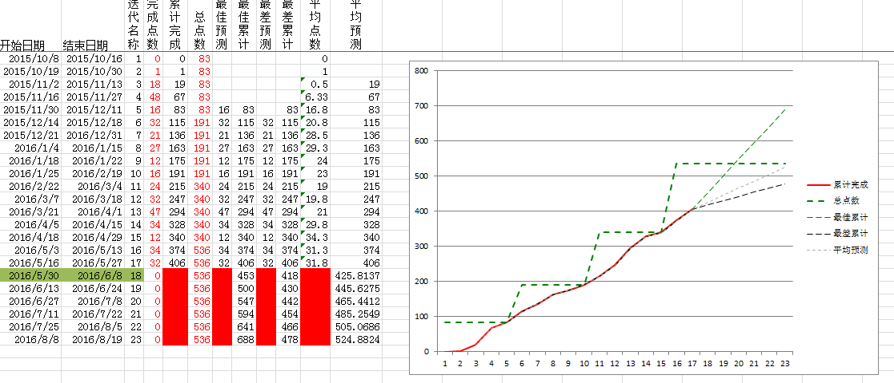
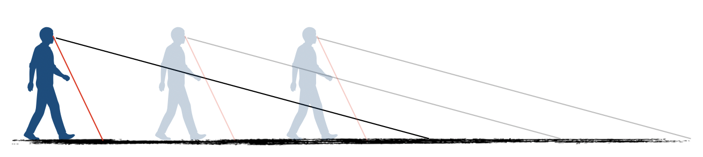

# 要不要估算，如何估算，如何使用

作者：王宇（ACT Leader）

> "开始做一件事的时候，若不是预先计算一下需要多少代价，若不是预先对自己的力量做一个正确的估计，那真是太愚蠢了。"——鲁滨逊漂流记

## 放弃估算吗？

最近几年对于估算有一个观点是倾向让你放弃估算，并说出了种种来进行说明。你是否也有不打算估算的冲动了呢？如果你咨询我的意见，我会告诉你请尝试，如果你发现有问题的话你自己会调整的。

这让我想起了一个事情，看板之父，戴维安德森前几年准备出一本关于看板实践方面的书籍，让一位相关人员来到中国收集看板使用的素材信息。这个人来到中国非常吃惊的看到，看板上的每一个卡片都有承诺移交时间、估算、进度跟进等等信息。她震惊到这不是看板方法的关键点啊，这哪里是流水一般的改进，这简直是赤裸裸的剥削和压迫啊。

我想对她说，如果贵国的房贷和我们一样沉重，如果你们的系统和我们的一样耦合严重，如果你们的人员素质和我们一样参差不齐，如果你们的版本也和我们一样拥有无比的压力。你也会用我们相似的手段的。

其实该不该用估算，取决于上下文，以及风险的可控预期。而不是理论的正确与否，你可以用或是不用。就如同你问我该吃什么东西一样，吃什么取决于你身体需要什么。当然你说我根本无法感受我身体需要什么啊。这时候就有各种营养专家进行推销自己的理论和思路。

你能说这些营养专家的思路错误吗。不能，你可以试验一下。看看身体的反应，然后再进行调整。

如果你是自己投资的项目，拥有无穷的开发预算和人力安排。要啥估算，数个数就可以了。然后计算花的经费和挣的银子的比例，平衡一下就可以了。但如果是一个甲乙方的项目，并且项目的实施细节充满风险。你是否敢放弃使用估算呢？

## 回到估算本身

我个人倾向是使用估算的。起码对于不太成熟的团队要使用估算。估算的本身不是知道精确的工作量，而是让大家对于工作的风险有一个强制的校准过程。你可以说这个过程是耗费时间的，但也有方法让它快速完成。

我一般会要求团队在需求成为板砖的瞬间进行估算，这个时候风险要保证已经控制住了。这个时候一般用相对估算就可以了。你可以理解这是一个打远光灯的过程。

在马上要开始工作的时候再次进行估算，这次估算使用时间进行估算，以半小时为单位明确工作任务。可以理解这个过程是打近光灯的过程。

介绍估算的思路分为三个部分，第一是态度，第二是标准，第三是方法。态度就是你要如何使用估算，使用的边界是什么（指导原则）。标准就是你使用的标准和概念，方法就是实施流程与时间点的选择（让手段得以实现）。

### 态度

在使用估算的背后应该有如下的倾向和理解：

 * 建议与鼓励
    1. 通过估算平准需求粒度
       * 对需求进行横向比较；
       * 估算其实是一种非常直接的粒度反馈手段。但这里需要注意的是不要使用比较大的数值或估算单位。因为如果你使用比较大的数值或估算单位粒度平准化的过程其实就没有发生过。
    2. 通过估算校准大家理解
       * 校准需求理解偏差；
       * 每个人对于需求的理解是不同的，估算就是探索每个人对于需求不同理解程度的探针。你说1，我说5那肯定咱们俩理解有一些偏差。恰恰是这些偏差之中可能蕴含着需求潜在的风险或机会。
       * 通过讨论拆分与估算的过程其实是一次提前的设计过程，尤其对于潜在风险较多的需求，如何识别？如何应对？是我们需要持续投入精力的领域。
     3. 通过估算进行风险控制
       * 对需求风险领域进行探测；
       * 当你能给出一个事物的估算的时候，其实基本实施的思路就已经明确了。这个过程就如同拆分一般，如果说拆分是第一遍对风险的控制技巧，那估算就是第二遍对风险的控制技巧。
       * 我经常遇到一个现象就是研发人员已经觉得需求讨论得差不多了，一问他给个估算吧，他就说咱们再讨论一下细节吧。
* 不建议
    1. 估算不代表真实实施工作量
       * 我们经常喜欢把一个形容词放在估算的前面，那就是”精确“的估算。但是精确就不可能是估算，估算就不可能是精确的。你完成了估算很少的需求任务不一定代表你工作量很小，你完成了估算很多的需求任务不一定代表你工作量很大。因为这只是估算，只是为了计划和风险控制的目的进行使用。
    2. 估算不代表工作效能
       * 当你特别在意估算，并把它与某些值相乘或相除形成工作效能数字的时候。估算就已经开始发生偏移了，因为它不光和估算有关系还和未来开发人员的工资形成关联。估算就进入了一套拥有更多变量的计算公式之中。
    3. 估算不代表承诺完成
       * 估算的时间不是从任务开始到任务结束的理想时间，如果你这么认为了的话。研发与实施的人员就会不停的增加缓冲数值（Buffer）。任何事物太在意的话就会有偏差。

度量建议参考《如何通过度量更好的管理技术组织》文章中的内容进行度量。

## 标准

一开始软件研发的估算我们使用线性数列，也就是1、2、3、4、5、6……。当然，1和2之间还可以分出1.5，甚至是1.125等数字。其实就是数字而已，你愿意用什么数字就用什么数字。一般这个数字表示人天花费，也就是一个人需要做多少天。

在接触敏捷项目之后，我开始尝试使用斐波那契数列进行估算。斐波那契数列就是1、2、3、5、8、13……，后面一个数字是前面两个数字的合。估算的时候都是相对估算，也就是相似工作量的需求应该给出相似的数值。相对估算的斐波那契数列有几个好处：

1. 逼迫拆分：只能用这几个数字，而且越大的需求基本就放大很多。所以拆分是自然而言的事情，要不然偏差太大。
2. 业务角度可以提出反馈：这种方式是相似工作难度的给出相似的数字，业务角度可以直接参与进来进行需求理解的校准。1的需求放在一起，2的需求放在一起，业务同学可以非常清楚的识别某些他认为复杂的需求为什么给出小的点数，为什么他认为这个相对比较简单的需求为什么会给出更高的估算。
3. 不太纠结，速度挺快。只有这几个数字可以使用，所以速度相对较快。

用了一段时间我们开始使用一种新的数列，叫”二的力量“（power of two），这个数列是1、2、4、8、16……。这种数列相比较斐波那契的优势估计你一眼就能看出来。那就是更为陡峭了，更加逼迫拆分。

又过了一段时间，我们逐渐开始使用另一种数列。这严格说不是一种数列更是一种归堆方式：衬衫大小。XXS、XS、S、M、L、XL、XXL。因为不管之前我们用什么数列，程序员们都会在内心使用一个神奇的公式来计算大概应该干多少人天。衬衫大小就可以把这种倾向消灭在产生之前。当然，使用衬衫大小的估算，对于项目管理来说最后也都会换算成人天的区间范围。

不管怎么说衬衫大小对于一个相对成熟的敏捷团队来说，是比较到位了。但对于一般的团队来说，建议使用斐波那契数列中的一些数值：1、2、3、5、8。原因如下：

1. 团队人天概念根深蒂固，人天也没问题。但是相似需求要拥有相似点数（相对估算）。这样业务就能参与进来。
2. 8以上的数值不进行使用，估算为8的任何需求都要重点跟进一下。因为8可能不代表是8倍的1，而是技术人员找不到更大的数值给这个需求而已。而且更大的估算值的存在不利于需求的拆分。

另外需要注意的是，估算需要能够引入业务的参与。也就是说拆分之后的需求，从业务人员的角度可以根据之前需求的估算对新的需求提出质疑。因为从业务角度可以看到复杂度，并且了解之前类似的需求的一个估算值。也就是说之前有过一个类似的东西估算是2，那如果新的需求和之前的类似的话，这个新需求也应该给出2的估算。如果给出更大的估算，那技术人员需要能够说明白。

但是如何得到这些数字或标签呢？我们需要涉及……

## 方法

扑克估算：扑克牌中有代表估算的若干数字，一般是0、1、2、3、5、8、13、20、40、60、100、无穷大。使用方式是明确一个目标需求，每个人选择一个估算卡片但不让其他人看到，当所有人选好之后统一亮牌。大点数和小点数卡片的人说明一下原因。当说完原因之后，大家再一起打一次牌。【不推荐使用：太费时间】

石头剪刀布：用手指头的方式，针对一个需求，1、2、3统一伸出你的手指，用手指的数量代表估算。这种方式相比较扑克牌的方式依赖更少、速度更快。但如果有不统一的现象还是需要讨论和沟通的。【不推荐使用：太费时间】

估算2.0：就是有一个人从需求池中拿出一个需求放到桌子上，另一个人从池子中拿出另一个需求，与这个需求进行相对比较，比如更大就放在刚才需求的右面，更小就放在刚才需求的左面，相似就放在下面。然后下一个人再从需求池中拿出新一个需求放入这个工作量估计的队列之中。然后回到第一个人再从需求池中放置到这个工作量对比的队列之中，并与之前工作量估算之后的需求进行对比排列。当某个人认为之前的估算放置的位置和自己理解有出入的话，他可以在轮到自己的时候对卡片进行调整，并说出自己的理由。这样几轮下来就能把估算完成。然后选择出一个标准的估算数值的一列，其他这种方法的好处可以在很短的时间内完成大量需求的估算，同时能够收集足够多的信息。【推荐使用】

## 项目进度估算

这是一个Excel图表的截图，虚线就是已经完成估算的板砖需求数量。红色的线为每个迭代我们实际完成的点数。速率就是每个迭代完成的点数。从当前迭代向回看5个迭代取平均速率，向未来延伸出去，这就是最有可能需求完成的时间点。过去5个迭代最低速率向未来延伸，这就是最差估计的完成时间。过去5个迭代最高速率延伸就是最好状态下团队的进度情况。

## 需求开始之前的再次估算

我带的团队会要求在任何需求开始之前再次估算一下，这次的估算是反向让你更清楚了解实现的思路。这轮估算我一般会要求使用半小时作为一个单位进行估算。需求开始之前的估算不用来进行任何统计分析。为什么不用来统计分析呢？

因为所有进行统计和分析的需求，都是在从沙子移动到板砖的瞬间进行估算的。在这个时间点，就如同下图的黑色视野一般。估算的标准都是远视野的内容，在这个视野模糊程度是固定的。

但如果我把需求开始前的估算和板砖阶段的估算进行对比的话，这本身就存在尺度不一的状况。而且还容易给大家造成我们需要精确的估算这一幻觉倾向。

## 总结

1. 我们使用估算来：
   * 平准需求粒度；
   * 校准大家彼此理解；
   * 进行风险控制；
2. 注意不要：
   * 与个人效能挂钩；
   * 与承诺挂钩；（尽管确定版本需要承诺，但不要以估算为准）
3. 估算要求：
   * 使用1、2、3、5、8几个数字；
   * 相似需求给出相似的估算值；
   * 通过需求的工作量排序来确定估算范围；
   * 使用估算2.0的估算方法；
   * 不要使用估算扑克；
4. 项目进度预测可以使用燃上图进行预测；
5. 需求开始之前需要再次以半小时为单位进行估算，但估算结果不计入统计分析。