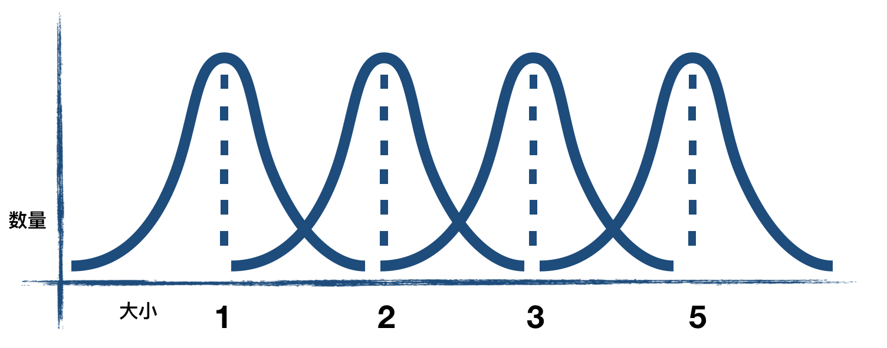
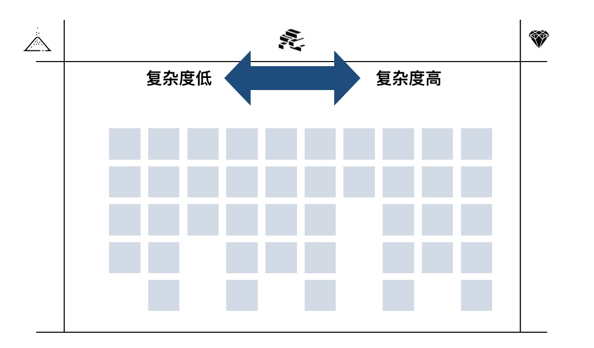
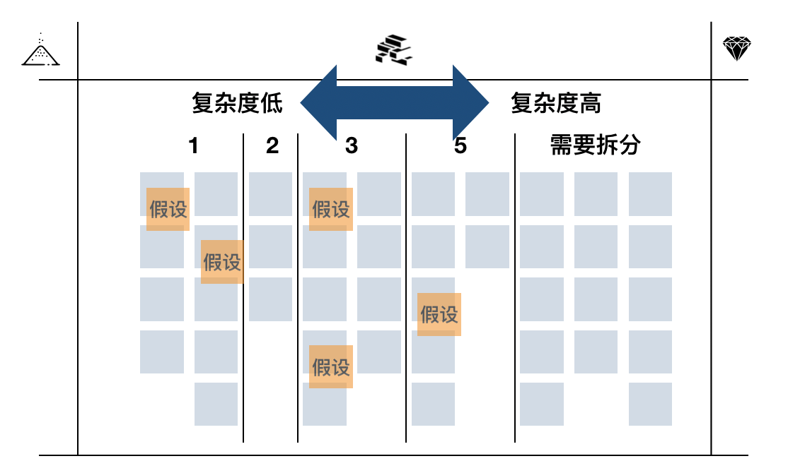

# xxx

作者：王宇（ACT Leader）

与拆分、澄清一样，估算也是一个软件圈子里方法无数，不停讨论，时不时就跳出来恶心一下大家的话题。有趣的是这个东西因为与工作量相关的关系，所以在桌子之下有更多的力量在相互抗衡。咱们先说说工作量的事情，说明白你到底干了多少东西好像是一个天经地义的事情，这种说明白的过程很多时候是事后才会发生的。我个人认为这和估算的本意与初衷有着本质的差别。

任何的组织在运作的过程之中，专业化与职能化的演进就没有停下来过。专业化与职能化的过程使得公司更方便的到市场上寻找到人员，并且组织真正的资产其实就是流程与数据。所以组织的演进会使得专业化与职能化得到明确的进步。

随着组织的演进与发展，对于技术团队把事情说明白就是一件非常重要的事情。而且明确团队之间工作量情况也是很多年终需要考评升级的必要内容。很多人就想到了使用工作量估算作为某种证明来说明一些问题。对于组织内的度量，请参考之前写的《如何通过度量更好的管理技术组织》。但在这里，对于工作量估算来说，非常明确的是……

## 估算不能用于知识工作者的绩效评价

估算是从现在看未来的一种方式，这种方式可以用于风险控制（估算较大的部分存在风险）、需求理解与分析（无法极致理解也就无法给出估算）、设计（形成具体方案才能进行估算）的辅助手段。如果对未来进行计划的话，这也是从现在看未来的角度。这种对未来的估计，有着非常大的不准确性。一旦我们想赋予估算更多的使命的时候，这个时候就会发生……

### 行为关注点的飘移

做一个比喻，如果让你估计走到前方汽车位置的需要走几步，或者需要多少时间能走到。这种就是对未来的一种预测，这种预测就会触发风险控制、任务分解、详细安排等等。如下图：

当把估算赋予更多的使命的时候，比如根据估算的步数或时间来决定给这个人多少奖金。首先你需要增加更多的人手来寻找到一个更“精确”的估算，也需要引入第二方甚至第三方来确保这个过程是在监督之下完成的。但你又如何保证引入的角色公平与公正呢？那是否需要引入更多的过程与标准来保证这件事的执行呢？

到最后，估算已经不单单是估算。它有可能成为决定实施者获得奖励的证明，但这一切都是基于对不确定未来的预测，有可能与当初的目标大相径庭了。最后这个人可能会更多关注估算中的数字而不是把事情认真做好。

退后一步的说，如果真是估算多少步的话，可能还好说。这起码是个简单的事情，但真正痛苦的是……

### 对知识工作的不敬畏

想象一下你要写一篇文章，这是一篇论文级的内容。非常有可能每个人的时间估算截然不同。但为什么每个人对于自己编写一篇文章的估算有着非常大的差别呢？

因为编写文章是一个创造性的智力活动，是一个知识工作者的工作，而不是一个体力工作者的工作。随着组织专业化与职能化的演进过程，甚至某些基础设施与类库的使用。我们其实是尝试把知识工作向一个体力工作进行转变。但这种尝试是把组织中的创造力逐渐抹杀的过程。

这让我想起了很多年前4GL语言蓬勃发展的时间，像PowerBuilder、模型驱动开发一样的工具，号称是编程的未来。解决大多数的问题非常的迅速且直接，但是死就死在了那少数无法解决的问题之上。这就是尝试把问题降维解决的方式，但是最终没有降维问题，只是降维了手段，最终问题的复杂性还是导致了这种方式的落末。

不管用多科学的方法进行组合和尝试，就如同用一堆肉拼凑出一个生命来一般，是一种还原论的遗毒。

> 还原论（英语：Reductionism，又译还原主义、简化论、专简论与化约论）是一种哲学思想，认为复杂的系统、事务、现象可以通过将其化解为各部分之组合的方法，加以理解和描述。----维基百科

恰恰是组织中专业化与职能化的趋势，使得我们认为复杂的事情可以通过这种方式进行解决。因为一旦专业化和职业化完成之后，组织就会沉淀流程与数据，人员就成为可以替换的零件。但真相是……

#### 我们花了无数的精力来尝试得到所谓更靠谱的估算，但最终无法摆脱其估算的本质。

有些组织想验证一个事情就是，研发团队的压力是否合适。他们是更闲一些呢？还是更忙一些呢？如果是一些搬砖的工作，我们就很容易确定他们是更闲还是更忙。有一个简单的方式能够探测他们的忙闲程度，那就是融入团队，参加一下站会，参加一下需求梳理的会议。之前我在指导的一个团队在召开站会的时候，主管就直接识别出几个外包同事无所事事，当天让他走人的。而且很多领导都有查看团队看板的习惯，通过这种方式来感受不同的团队的状态才是一个更靠谱的方式。

对于尝试使用估算与绩效关联的行为，其实是一种管理的偷懒行为。回到估算本身，我们再明确一下……

## 估算用途与目的

 * 建议与鼓励
    1. 通过估算平准需求粒度
       * 对需求进行横向比较；
       * 估算其实是一种非常直接的粒度反馈手段。但这里需要注意的是不要使用比较大的数值或估算单位。因为如果你使用比较大的数值或估算单位粒度平准化的过程其实就没有发生过。
    2. 通过估算校准大家理解
       * 校准需求理解偏差；
       * 每个人对于需求的理解是不同的，估算就是探索每个人对于需求不同理解程度的探针。你说1，我说5那肯定咱们俩理解有一些偏差。恰恰是这些偏差之中可能蕴含着需求潜在的风险或机会。
       * 通过讨论拆分与估算的过程其实是一次提前的设计过程，尤其对于潜在风险较多的需求，如何识别？如何应对？是我们需要持续投入精力的领域。
     3. 通过估算进行风险控制
       * 对需求风险领域进行探测；
       * 当你能给出一个事物的估算的时候，其实基本实施的思路就已经明确了。这个过程就如同拆分一般，如果说拆分是第一遍对风险的控制技巧，那估算就是第二遍对风险的控制技巧。
       * 我经常遇到一个现象就是研发人员已经觉得需求讨论得差不多了，一问他给个估算吧，他就说咱们再讨论一下细节吧。
    4. 对未来进行概要预测
       * 注意这里概要这个词的强调
       * 比如我们每个月平均完成100个点数的需求，那我们就知道起码我们要准备出比100个点还多的钻石需求以供研发使用。下图是一个Excel图表的截图，虚线就是已经完成估算的板砖需求数量。红色的线为每个迭代我们实际完成的点数。速率就是每个迭代完成的点数。从当前迭代向回看5个迭代取平均速率，向未来延伸出去，这就是最有可能需求完成的时间点。过去5个迭代最低速率向未来延伸，这就是最差估计的完成时间。过去5个迭代最高速率延伸就是最好状态下团队的进度情况。

所以在估算完成之后，我们要问自己几个问题：

1. 需求粒度平准了吗？（有没有太大或者太小的需求？）
2. 相关人员是否对需求有了一致的理解？（设计、步骤、结构是否都校准理解？）
3. 风险是否得到识别和跟进？（比如是否填写需求或技术的相关假设？）
4. 我们需要在哪个时间点前完成多少钻石需求的编写与确认？（研发相关的需求推进任务有哪些？业务相关的需求推进任务有哪些？）

如果这几个问题都得到了明确的答案，恭喜你，估算用对了。

最近几年对于估算有一个观点是倾向让你放弃估算，并说出了种种来进行说明。你是否也有不打算估算的冲动了呢？那我们是否要……

## 放弃估算吗？

对于是否使用估算我认为，这取决于上下文，以及风险的可控预期。而不是理论的正确与否，你可以用或是不用。就如同你问我该吃什么东西一样，吃什么取决于你身体需要什么。当然你说我根本无法感受我身体需要什么啊。这时候就有各种营养专家进行推销自己的理论和思路。

你能说这些营养专家的思路错误吗。不能，你可以试验一下。看看身体的反应，然后再进行调整。（本文是推荐使用估算的，也是营养专家哈）

如果你是自己投资的项目，拥有无穷的开发预算和人力安排。要啥估算，数个数就可以了。然后计算花的经费和挣的银子的比例，平衡一下就可以了。但如果是一个甲乙方的项目，并且项目的实施细节充满风险。你是否敢放弃使用估算呢？

这让我想起了一个事情，看板之父，戴维安德森前几年准备出一本关于看板实践方面的书籍，让一位相关人员来到中国收集看板使用的素材信息。这个人来到中国非常吃惊的看到，看板上的每一个卡片都有承诺移交时间、估算、进度跟进等等信息。这个人颇为震惊的表达这不是看板方法的关键点啊，这哪里是流水一般的改进，这简直是赤裸裸的剥削和压迫啊。

我想说，这恰恰是承认现状的表现，如果贵国的房贷和我们一样沉重，如果你们的系统和我们的一样耦合严重，如果你们的人员素质和我们一样参差不齐，如果你们的版本也和我们一样拥有无比的压力。你也会用我们相似的手段的。

如果你要使用估算的话，那我们要讨论一下……

## 估算的关键点

估算有两个关键点，这两个关键点就可以快速的让我们得到相对靠谱一些的内容。这两个点是：

### 样本数量大

任何的估算都有偏差，但如果从统计学角度来看，样本数量大的话从整体的角度就会平衡个体的估算偏差。如下图所示：

这里需要注意的是，如果你估算的需求都去和之前估算完毕的需求进行相对比较的话。其实就符合统计学上这个样本数量大这一要求。但如果你每次只关注眼前的几个需求，并进行估算的话你就会面对更大的不确定性。

### 个体粒度小

如果允许100为最大单位进行估算的话，绝对会有一些需求的估算是100。但这个需求的大小就是100吗？不是的，只不过我们找不到更大的数字了。但这些估算为100的需求有可能意味着1000，10000，甚至更大。但粒度小的需求一方面变化范围不会太大，另一方面把变化部分在拆分的过程中也会进行隔离与分解。我的经验是切分到3天左右。切分方法见文章最下方的参考链接。

## 估算标准的选择

一开始软件研发的估算我们使用线性数列，也就是1、2、3、4、5、6……。当然，1和2之间还可以分出1.5，甚至是1.125等数字。其实就是数字而已，你愿意用什么数字就用什么数字。一般这个数字表示人天花费，也就是一个人需要做多少天。

在接触敏捷项目之后，我开始尝试使用斐波那契数列进行估算。斐波那契数列就是1、2、3、5、8、13……，后面一个数字是前面两个数字的合。估算的时候都是相对估算，也就是相似工作量的需求应该给出相似的数值。相对估算的斐波那契数列有几个好处：

1. 逼迫拆分：只能用这几个数字，而且越大的需求基本就放大很多。所以拆分是自然而言的事情，要不然偏差太大。
2. 业务角度可以提出反馈：这种方式是相似工作难度的给出相似的数字，业务角度可以直接参与进来进行需求理解的校准。1的需求放在一起，2的需求放在一起，业务同学可以非常清楚的识别某些他认为复杂的需求为什么给出小的点数，为什么他认为这个相对比较简单的需求为什么会给出更高的估算。
3. 不太纠结，速度挺快。只有这几个数字可以使用，所以速度相对较快。

用了一段时间我们开始使用一种新的数列，叫”二的力量“（power of two），这个数列是1、2、4、8、16……。这种数列相比较斐波那契的优势估计你一眼就能看出来。那就是更为陡峭了，更加逼迫拆分。

又过了一段时间，我们逐渐开始使用另一种数列。这严格说不是一种数列更是一种归堆方式：衬衫大小。XXS、XS、S、M、L、XL、XXL。因为不管之前我们用什么数列，程序员们都会在内心使用一个神奇的公式来计算大概应该干多少人天。衬衫大小就可以把这种倾向消灭在产生之前。当然，使用衬衫大小的估算，对于项目管理来说最后也都会换算成人天的区间范围。

不管怎么说衬衫大小对于一个相对成熟的敏捷团队来说，是比较到位了。但对于一般的团队来说，建议使用斐波那契数列中的一些数值：1、2、3、5、8。原因如下：

1. 团队人天概念根深蒂固，人天也没问题。但是相似需求要拥有相似点数（相对估算）。这样业务就能参与进来。
2. 8以上的数值不进行使用，估算为8的任何需求都要重点跟进一下。因为8可能不代表是8倍的1，而是技术人员找不到更大的数值给这个需求而已。而且更大的估算值的存在不利于需求的拆分。

另外需要注意的是，估算需要能够引入业务的参与。也就是说拆分之后的需求，从业务人员的角度可以根据之前需求的估算对新的需求提出质疑。因为从业务角度可以看到复杂度，并且了解之前类似的需求的一个估算值。也就是说之前有过一个类似的东西估算是2，那如果新的需求和之前的类似的话，这个新需求也应该给出2的估算。如果给出更大的估算，那技术人员需要能够说明白。

但是如何得到这些数字或标签呢？我们需要涉及……

## 估算方法与流程

一个人从需求池中拿出一个需求放到桌子上，另一个人从池子中拿出另一个需求，与这个需求进行相对比较，比如更大就放在刚才需求的右面，更小就放在刚才需求的左面，相似就放在下面。然后下一个人再从需求池中拿出新一个需求放入这个工作量估计的队列之中。然后回到第一个人再从需求池中放置到这个工作量对比的队列之中，并与之前工作量估算之后的需求进行对比排列。当某个人认为之前的估算放置的位置和自己理解有出入的话，他可以在轮到自己的时候对卡片进行调整，并说出自己的理由。

这样几轮下来就能把工作量（复杂度）排序完成。接下来，确定估算数值。还是刚才那几个人，首先确定估算为1需求的位置，然后再确定估算为2的位置，依次类推。最后比5还要大的需求进行拆分。

对于估算完成的一些内容，也需要填写一些假设。假设也是风险管理的一部分，假设就是风险的前身，所以在估算的同时就要进行假设确定。

其他这种方法的好处可以在很短的时间内完成大量需求的估算，同时能够收集足够多的信息。

对于一些进入板砖的零星需求，就可以和之前的需求进行比较。相似复杂度或工作量的归于一堆，在估算的过程业务和测试人员是有发言的权力的。他们可以质疑，为什么之前那个需求是2，这个需求是3，这两个需求看上去复杂度相似啊。研发人员这个时候需要解释，甚至是修正估算。

## 需求开始之前的再次估算

我带的团队会要求在任何需求开始之前再次估算一下，这次的估算是反向让你……

### 更清楚了解实现的思路，并再一次管理风险

对于这轮估算我一般会要求使用半小时作为一个单位进行估算。需求开始之前的估算不用来进行任何统计分析。为什么不用来统计分析呢？

因为所有进行统计和分析的需求，都是在从沙子移动到板砖的瞬间进行估算的。在这个时间点，就如同下图的黑色视野一般。估算的标准都是远视野的内容，在这个视野模糊程度是固定的。

但如果我把需求开始前的估算和板砖阶段的估算进行对比的话，这本身就存在尺度不一的状况。而且还容易给大家造成我们需要精确的估算这一幻觉倾向。

## 总结

* 估算不能用于知识工作者的绩效评价
  * 会造成行为关注点的飘移（事情就不是单纯的这个事情了）
  * 对知识工作的不敬畏（用生硬的方式面对复杂的问题）
* 估算用途与目的
  * 通过估算平准需求粒度
  * 通过估算校准大家理解
  * 通过估算进行风险控制
  * 对未来进行概要预测
* 放弃估算吗？
  * 根据自己风险情况自行选择
* 估算的关键点
  * 样本数量大
  * 个体粒度小
* 估算标准的选择
  * 1、2、3、5、8（8就代表有风险）
  * 不用太强调点数或人天，但强调相似大小的需求给出相似的估算（业务可以参与）
  * 成熟团队可以放弃估算或使用衬衫大小；
* 估算方法与流程
  * 轮流相对比较进行排序
  * 确定估算为1的需求
  * 确定其他需求的估算
  * 明确假设与风险（依赖也是假设哦）
* 需求开始前的再一次估算
  * 不计入统计和预测
  * 用于更清楚了解实现的思路，并再一次管理风险

## 附录

为什么估算扑克不建议使用

* 打扑克太占用时间；
* 太多用不到的扑克牌数字（除了1、2、3、5其他都用不到）；
* 还需要带着的东西，也可能丢；