# 如何快速地澄清需求

作者：王宇（ACT Leader）

> 'A person hears only what they understand.'' ——Johann Wolfgang von Goethe
> “一个人只能听到他所理解的东西。”——约翰·沃尔夫冈·冯·歌德

## 如此情况

我在指导研发团队的过程中，有一种声音不停的出现，那就是：会议占用太多的时间了。在众多会议之中，需求澄清会议是一个技术人员和业务人员逃也逃不了的会议。如何尽可能的有效提高需求澄清的效率一般也成为了敏捷教练或技术管理者面临的问题。

如果有一个澄清会议的话，一般会有这么两种声音盘旋在会议室的上空。一种声音：我发的文档你提前看过了吗？你有什么不明白的内容吗？这个倒霉文档实在不想再花太多时间和精力了，我的事情太多了。另一种声音：需求能靠谱一些吗？一堆细节难道这不是该写的需求吗？真希望拍脑袋的想法少一些啊。

在这样的会议背景之中，往往会很容易陷入细节的泥潭，又或者掉入一个兔子洞，然后不停的掉入这个洞里的其他兔子洞中，一直掉下去。

我们认为，澄清与沟通的过程应该是这样的：

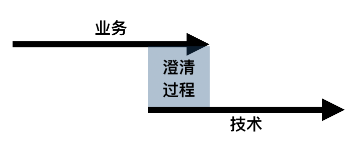

但实际的澄清过程可能是这个样子：

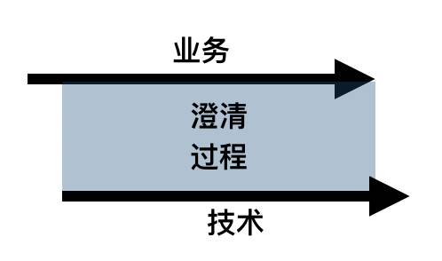

也就是说，原来以为澄清的过程是一个流程的某个阶段。这个过程可能就是经典的软件研发流程：计划（Planning）、分析（Analysis）、设计（Design）、实现（Implementation）、测试与集成（Testing&Integration）、维护（Maintenance）。在每个阶段与每个阶段的交接的部分，应该时间比较少，要求更为清晰和明确才是。

现实的情况是我们在需要更多的时间进行澄清和沟通，以至于我们同时工作的事项（并行工作）非常的多。这已经感觉到是一种新的常态了。所以对于业务负责人和技术负责人来说，能够并发处理的事项已经成为了一项基本要求。

各位请思考一下是否我们……

## 基于错误的协作假设进行工作

让我们重新思考一下我们的工作，一般来说有几种工作类型：简单、繁杂、混乱。见下图：

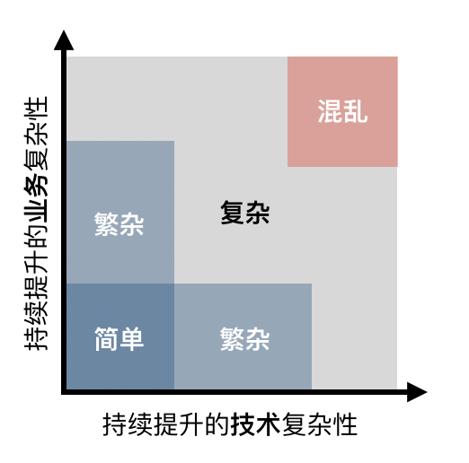

对于技术（实现）和业务（需求）都不复杂的状态，我们称之为简单工作。繁杂的工作是在业务或技术的一个领域之中拥有一些复杂性，但是在另一个领域之中还是一个简单象限的工作。对于繁杂的工作，只要业务或技术人员单方面多努努力（多加加班），就能应对相应的工作。混乱的工作业务和技术的可预见性基本为零，你可以想象一下冲进火海的瞬间，应该就是这样的。

我们知识工作者大部分的协作工作其实是在复杂的部分游走，在这个领域技术的复杂性可能会导致业务复杂度的改变，业务复杂性也可能直接导致技术复杂度的调整。也就是说最终的实现结果是需要平衡业务与技术的产物，或者说是业务与技术相互妥协的结果。

这也就是说，我们脑中基于流程协作的假设对于越复杂的工作越是失去效果。在越复杂的工作之下就需要一起来面对同一个问题，而不是某个角色完成一部分工作，再交接给另一个角色进行完成。

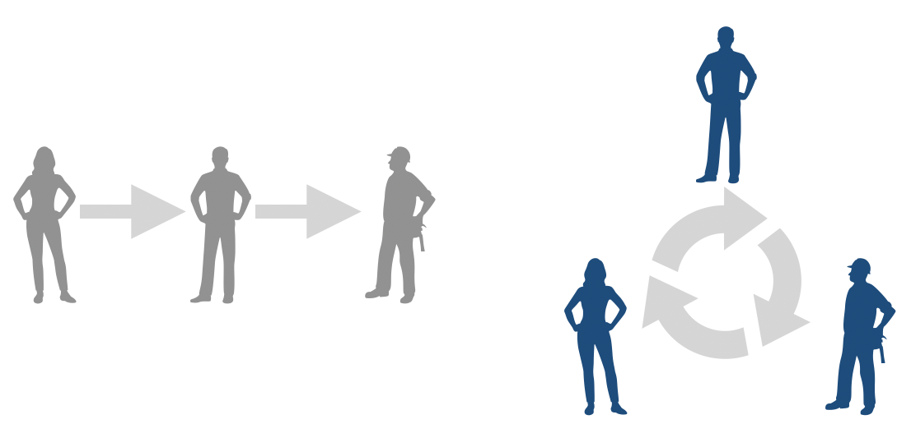

上图中左面部分的是我们脑中的简单协作模型（基于流程有时间顺序），右面是脑中不太好理解的协作模型（基于协作没有时间顺序）。一般来说无法理解也就无法记忆，所以大家一提及需求沟通左面的协作模型就会浮现出来。

所以，如果精确的来说，这不是一个需求澄清的过程，而是一个**需求持续相互校准的过程**。所以说这不是一个标准走流程的过程，这是一个协作碰撞的过程。一定要拥有协作的心态，而不是走流程的心态进入讨论过程。

如何便于理解同时便于快速获得协作的结果呢？

## 定义需求明确度的状态与阶段

有很多需求实现阶段的定义方式。比如看板方法的：

* 想法池（Idea pool，已提出）-> 已选择（Selected） -> 已分析 -> 已设计 -> 已开发 -> 已测试 -> 已上线。

对于看板价值流的设计一般还会在每一个状态完成之前添加在办（Doing）的一个状态，比如设计中，开发中，等等。因为咱们不是看板的内容，所以此部分内容简单描述。

Scrum的基本建议：

* 待办（TODO） -> 在办（Doing） -> 完成（Done）

我个人比较喜欢Pivotal的建议（它已经把需求计划状态和实施状态进行解耦了）：

* 计划状态：不办（Icebox） -> 待办（Backlog）-> 当前迭代（Current Iteration）-> 完成（Done）
* 实施状态：未开始（Unstarted）-> 开始（Started） -> 完成（Finished） -> 已交付（Delivered） -> 已拒绝（Rejected） -> 已确认（Accepted）

这些划分的方法缺失了一个重要的维度，就是……

### 需求明确度

从开发人员可实施的角度来看，他们需要一个什么状态的需求呢？他们需要的极端明确的需求，每个字段，每个像素，每个输入和输出都需要明确定义。可能这部分内容需要测试人员的输入，但对于他们来说这一切的一切都是需求。这种需求状态才能够被开发，测试人员才能进行验证。我们称这种需求的状态为……

#### 钻石

钻石需求的特点是：

* 细节完备：对于当前的需求来说，没有任何细节的描述是缺失的。需求可以指导开发与测试最细级别的具体工作。
* 边界清晰：完成了就是完成了，没完成就是没完成。需求的边界不是模棱两可的状态，而是明确且分明的。

钻石标准对于每个团队来说是不一样的，也就是说每个团队要形成自己的钻石需求的标准。比如如下内容：

 * UI/UE（高保真图示）（必选，及详细要求）
 * 验证点/变更点（业务验收点）（必选，及详细要求）
 * 关联方信息与接口细节（必选，及详细要求）
 * 验收条件/案例（测试编写，可选，及详细要求）
 * 现有流程（可选，及详细要求）
 * 变更后流程（可选，及详细要求）
 * 接口变更点（可选，及详细要求）
 * 性能要求（可选，及详细要求）
 * 安全要求（可选，及详细要求）

对于金融行业的团队根据自己团队的需要，钻石标准还可能包括对账户、大数据、埋点、凭证、涉及反恐洗黑钱等等要求。对于不同团队来说，钻石标准是不一样的。

当然，钻石标准不一定是非要有无数细节要求的。因为这些细节要求可能随着时间的流逝而凝固到研发团队的大脑之中。如果很多上下文的细节领域信息或背景都存在在彼此的脑海之中，业务一个眼神，研发就知道要做什么内容，有什么要求。这样的话，写得太细的话又显得多余了。关键是**研发团队要认可**其细节完备和边界清晰，并且如果细节内容少的话，后期也不需要查询和归档。

钻石需求就如同晚上开车的近光灯一般，把所有覆盖的细节全部显现出来。那些没有照到的黑色地方，我们称之为……

#### 沙子

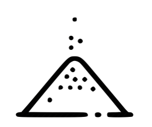

沙子需求就是充满未知潜在风险的需求，这种需求未经沟通，也未经拆分和估算过。你可以理解这种需求就是灯光未能照到的黑色区域，黑色区域有可能是平坦的路也有可能存在某个让人意想不到的障碍。

如果说是瀑布的研发过程，需求就应该只有这两种状态。而且在通过项目的某些评审环节之后，全部的需求都应该是钻石状态的。如下图所示：

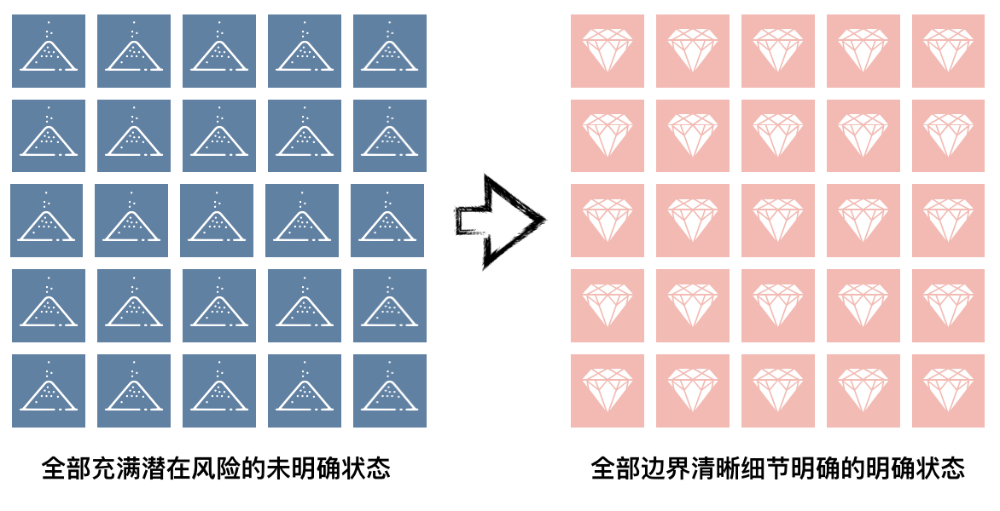

但如果这是探索一片未知的大陆的话，难道我们把所有的细节都分析明确了才会开车行驶吗？这样的成本有些太高了，所以敏捷研发过程的渐进式需求明确就拥有十足的意义了。我们需要在沙子需求和钻石需求之间引入一个新的概念……

#### 板砖

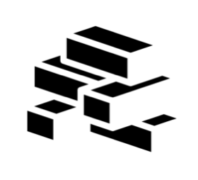

板砖的关键特征是：

* 粒度相似（经过拆分）：未经过拆分的需求其实就是无法实施和管理的需求，拆分成合适粒度非常重要。可以参考《如何拆分需求实现渐进式交付过程》粒度大小及拆分方法的建议。
* 拥有估算：如果不让开发进行估计的话，水有多深也是未知。估算一方面是形成大概工作量的手段，另一方面是管理风险的技巧。
* 风险可控（具有可实施性）：虽然使用拆分和估算来控制风险，但风险也有可能从其他维度影响需求。

我们期望的需求沟通与实现的过程是这个样子……

### 渐进式需求澄清（敏捷软件需求管理过程）

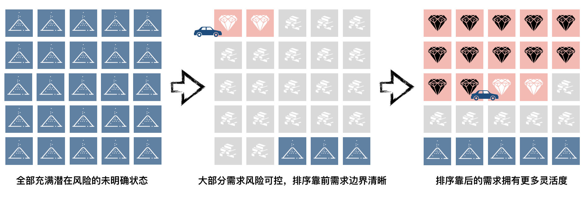

项目一开始，所有的需求都应该是沙子状态的，就如同我们要开车探索一片未知的大陆。需求的板砖状态就如同远光灯，让我们尽可能的确保已知的最远处风险是小的。近处我们需要确保更小的风险，因为车越快，我们打方向就不能太急。

好了，你现在已经指导需求分为三种状态：沙子（潜在风险）、板砖（风险可控，粒度相似）、钻石（边界清晰）。我们现在说一下一个……

## 典型的需求澄清（校准）过程

我们介绍登场选手：

* 业务人员（或需求分析人员、产品经理）：用蓝色标识；
* 技术人员（负责人或关键人员）：用红色标识；
* 其他关键人员（测试、安全、合规等）：用灰色标识；

在正式进入会议之前，如果有相关文档的话可以给所有参与者。

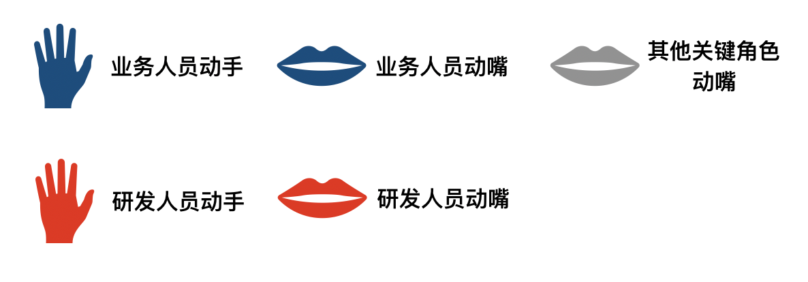

动手的意思不是让你打人哈，动手的意思是移动卡片，创建新的卡片，拆分卡片等等。动手的同时如果想发表一些观点是可以说话的。动嘴的意思也不是让你骂人哈，动嘴的意思是以说服和说明为目的的说话。但动嘴不能同时动手。

首先我们需要找一个比较大的平面，用报事贴和笔画出如下的结构：

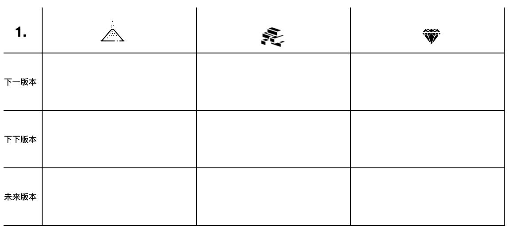

纵向表示三种需求明确程度（沙子、板砖、钻石），然后横向代表接下来的一次发布版本（也可以是迭代）、下下一次版本，和未来可能的版本。如果可能在版本的位置可以标识具体的时间点。

接下来，业务同学需要把之前的准备好的需求卡片放置在下一版本的沙子之中。如果某些需求已经达到板砖或钻石状态的话也可以放置在相应的位置上。

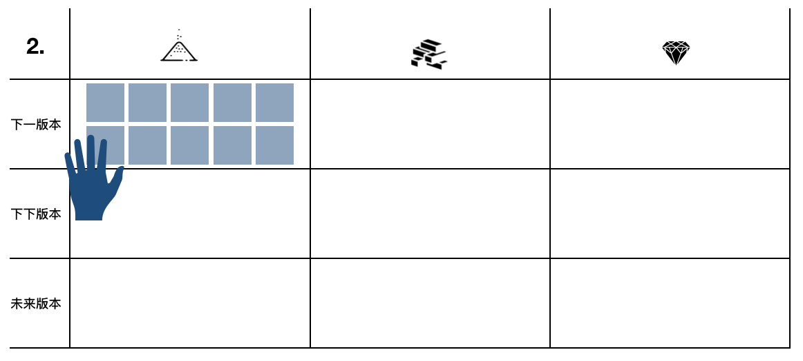

接下来，展示业务同学魅力的时候到了。比如业务同学指着某些卡片对着研发同学说，某某卡片我文档已经都给你了。你邮件也确认，赶快挪动卡片。我认为这些需求都已经讲过了，别废话，快挪动卡片。挪完，就可以散会了。

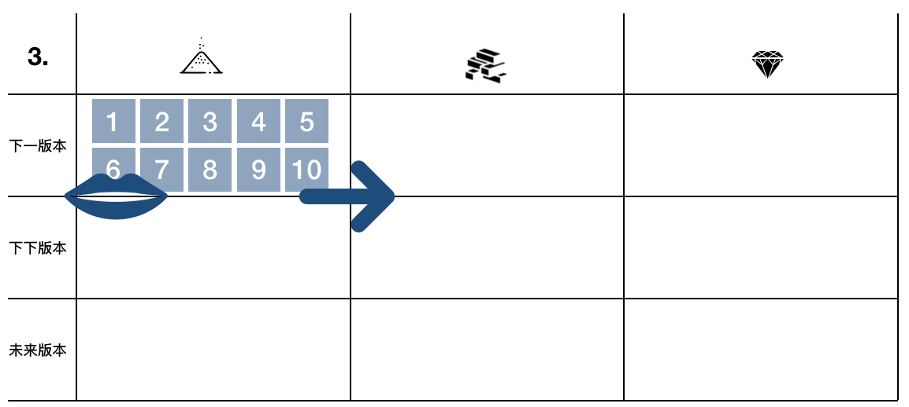

研发同学这个时候可以移动一些卡片到对应的位置。这时候要注意，移动过去就算研发同学认可了。在移动的过程中研发可能会有一些拆分的工作，并说明一些细节给在场的其他人员。在挪动到板砖部分的时候，可能需要增加估算或明确假设与依赖等等内容。（这里的颜色不同只是表示移动后的状态，真实的卡片颜色可能是相同的）

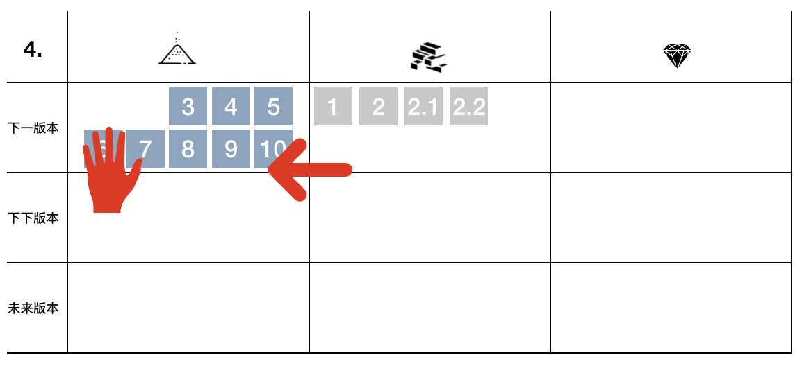

在这个过程中业务同学，可以不停的推进其他卡片向钻石部分移动。当然也最好所有的需求都在下一个版本上线。在业务同学催促声音之下，研发同学要把好板砖的标准关。

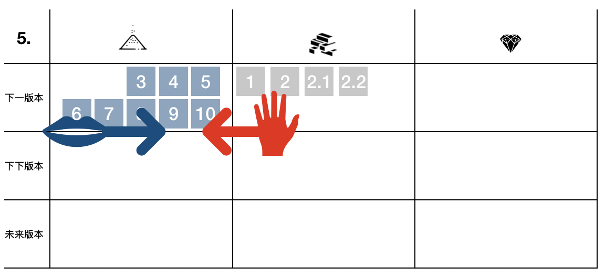

业务同学可能会推进某些需求到钻石的部分。当然这个过程，需要很多的描述与沟通，适当的时候可能会拿出投影机进行关键内容的展示。钻石的部分，就需要其他人员的认可了。比如测试、安全、合规等等关键人员的认可。移动卡片的工作还交给研发人员。

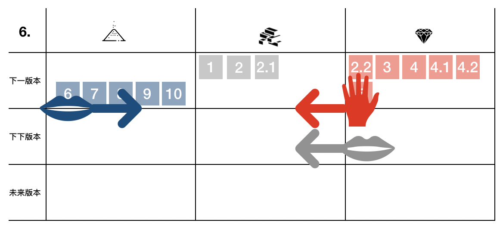

在移动的过程之中，研发和其他关键人员需要明确工作量以及相关依赖的准备情况。非常有可能的是某些需求被挤到下下版本，甚至未来版本之内。这个过程多询问业务人员的倾向，哪些需求可以移动到未来版本之中。

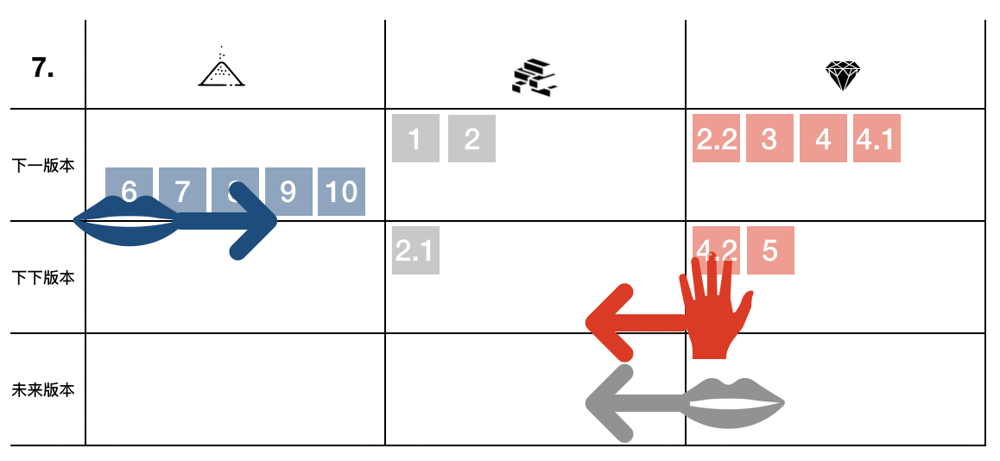

对于没有成为钻石且相对着急的需求，要标记处会后的待办事项与责任人。明确写出为什么这个需求不能挪动到钻石部分，还差什么，并明确什么时间点之前要完成哪些事项。大家达成一致之后。

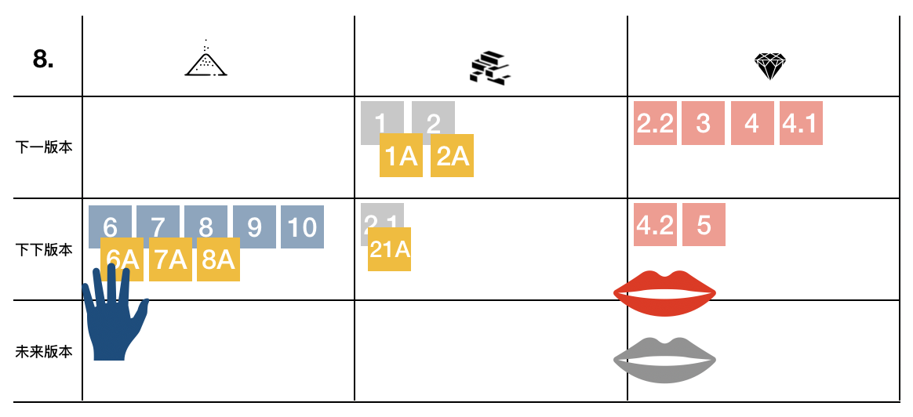

会议就可以结束了，约好下一次什么时候开会。如果需要紧接着进行黄色卡片的讨论也可以继续会议，但强烈建议中场休息一下。

### 关键点

 * 研发人员动手挪动卡片，确认放置位置；
 * 业务人员用尽一切其他方法推动卡片向前移动；
    * 说服、解释、翻邮件记录、投影展示、拉其他同事一起说、撒娇等等……
* 其他关键人员把控钻石标准，并严格限制研发放入卡片；
    * 考虑：比如测试人力、安全评审、合规内容、细节流程等等……
* 持续沟通并明确状态，用其他颜色报事贴或卡片明确责任与待办内容（不要过早的进入细节讨论）；
* 一定做好讨论之前的准备工作，可以提前发出阅读的内容尽量提前完成。

## 总结

1. 随着知识工作的复杂性的提高：
   * 需求澄清的本质是需求沟通协作校准的过程，而不是一个任务交接的过程；
2. 三种需求明确度的状态：
   * 沙子：拥有潜在风险；
   * 板砖：粒度相似、拥有估算、风险可控；
   * 钻石：边界清晰、细节完备；
3. 不同软件开发模式对需求状态的要求是不同的：
   * 瀑布软件开发
      * 开发实施之前，所有需求全都要求是钻石状态；
   * 敏捷软件开发
      * 渐进式需求校准：如同行驶在黑夜中的汽车一般，近期需求是钻石，远期需求尽可能都是板砖，少量沙子。随着研发过程的推进逐步产生更多的钻石需求。
4. 典型需求澄清（校准）的过程：
   1. 业务动口开发动手；
   2. 明确状态再进入细节；
   3. 各个角色严把钻石关；

