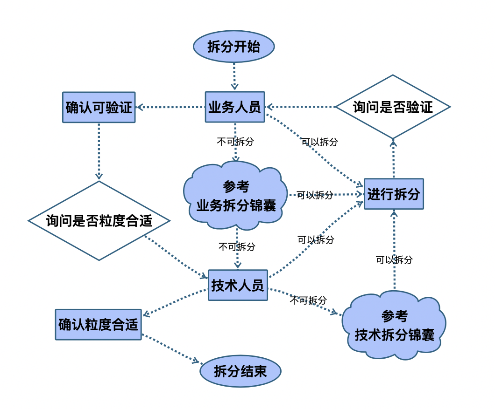

# 如何拆分需求实现渐进式交付过程

作者：王宇（ACT Leader）

> “天下大事，必作于细。” ——老子

## 拆分是一个永恒的话题

不管你用什么开发方式，什么管理方式，你都需要面对拆分的问题。每一次的敏捷培训的时候，那些经历过无数敏捷培训的学员们很多人还是对于拆分需求有一些含糊状态，并希望非常明确的给出一些建议。

有一个带我入行的软件师父，与他喝酒闲聊的时候跟我说过一个事情。手下人员接手了一个大型项目正在如火如荼的开发。他只给这帮弟兄一个要求，那就是把所有的工作事项拆分到3天的工作单位，并进行管理跟进。我的这个师父根本没有任何敏捷的理论概念与实际操作经验，但他有非常清晰的软件管理者常识。这个常识就是拆分，因为软件行业的特点就是这样的。

软件其实是一个从抽象非线性的概念到线性、具象并且能触及事物的过程。这个过程有太多不能提前预计的内容，可能来自业务的不确定性（市场机会变化、概念重新认知、等等），也可能来自技术的不确定性（新技术的尝试、架构的变更）。在平衡这些不确定的手段之中最有效的就是把需求进行拆分，然后风险高的尽可能早做。因为常识告诉我们：

> **你如果无法拆分的话，其实你根本不知道怎么干。**

所以说为什么要拆分：拆分是管理知识工作的必要手段。知识工作需要面对的太多是无法简单表明进度的场景。不像搬砖，不像流水线，干了多少一看就知道。如果没有拆分，进度管理、风险管理、依赖管理都无从谈起。

但很多人面对的直接问题就是，这个需求拆不了啊。我想说的是……

## 拆分是绝对可能的

在给学员培训的时候，我喜欢问大家一个关于拆分问题：把大象放到冰箱中需要分为几步。同学们会笑着说，分为三步：

**1. 把门打开；2. 推进大象；3. 再关上门。**

我说很好，你们拆分得非常到位。如果我现在要求你把“把门打开”的第一步进行拆分的话，你会如何拆分？时间感觉暂停了几秒钟，有人回答道：

**1. 走到冰箱前；2. 用手握住冰箱门；3. 用力拉。**

我说非常好，如果把这个第一步再次拆分会是什么？

**1. 抬起眼睛；2. 确定冰箱的位置；3. 迈出第一条腿。**

如果再把这第一步进行拆分，会是什么？

**1. 想着要干的事情；2. 慢慢的抬起头；3. 看向想象中冰箱的位置。**

这也就是说，从逻辑的角度其实我们可以无限的拆分下去。如果某人对你说一些需求无法拆分的时候，其实不是可不可以拆分的问题。因为一切的事物我们都可以按照这样的思路进行拆分下去，一直到分子、原子、粒子、夸克等级。就如同对于软件开发的过程，我可以拆分至你所需要写的每一行代码。但一个新的问题就会浮现……

## 更细的粒度是否有必要

拆分只要过了某个粒度程度，就会有一种没有必要的感觉。这种感觉其实是来自我们对于约定俗成与风险可控性的一种显性的表达。打开冰箱门，需要拆分分解吗？是个人就知道怎么做啊。打开冰箱门有什么风险吗？我做了无数次了啊。

风险来自于：一方面我们以为我们以为的就是我们以为（具备上下文的领域知识，或假设已经具备），另一方面我们过低的预测可能需要面对的风险（对风险的估计不足）。所以我的师父才会强制开发团队拆分成为3天左右规模的需求。这种拆分粒度对于软件项目来说非常重要，但如果拆分更细致的话，比如以小时为单位进行拆分，对于跟踪与记录来说就会存在粒度太细碎的问题。

太小（细碎）的粒度会带来管理成本的提高。因为每一项事情你都需要进行关注，进行管理。太细的粒度会导致管理成本提高。但如果粒度太大或太粗又会造成机会成本的提高。也就是你可能会因为粒度太大反馈速度太慢而造成一些更大的损失。我们需要再机会成本和管理成本之间进行平衡，这样粒度才是合适的。（如下图所示）

对于拆的太过细碎的需求，你完全可以打包形成一个单独的需求。这样其实拆小，拆细才是对需求管理的更高要求。

### 什么是合适的粒度

对于一般的具体软件开发项目来说，每一个任务**3天左右**的粒度是一个拍脑袋的经验数据。所以，任何开发工作都要从这个3天左右的粒度的任务进行汇总形成更高阶的任务合集。如果说你不能控制粒度到3天左右的话，也强烈建议最大工作量的任务在5天内完成。对于这个粒度的需求，就可以汇总形成便于管理与决策的内容，如下图所示。

我需要再明确一下，一切的决策建议都基于这个最细粒度的需求来进行整体讨论，而不是反向而行之。因为恰恰是这里粒度的工作任务才会平衡技术与业务的关键粒度，小了大家觉得太细碎了没必要讨论。大于这个粒度，技术的风险和业务的风险不一定能暴露。

这其实牵扯到一个非常重要的概念，就是估算。对于估算的更多内容，我们会有单独的文章详细介绍。这里就主要讨论粒度和切分手段。

到现在为止其实我们还没有触及敏捷概念，你可以理解上面的所有拆分就是按照功能与模块的拆分。如果整体同一时间点进行交付的话，这没有什么问题。一旦我们面对需要增量和不停市场反馈的场景之下，之前的切分手段就感觉捉襟见肘了。我们先需要的是……

## 增加敏捷的能力

敏捷的能力从产品的角度来看，就是能够尽早获得市场反馈的能力。这对于习惯于大而全进行设计的IT人员来说却是是一个挑战，因为整个设计的过程是贯穿整个开发的过程，每来一个需求都需要进行一次设计工作。所以对于是否打开敏捷能力的切分，我建议还是因不同情况而抉择。一次制作10个功能，和10个功能一次一次的做，显然第二种方法更费劲一些。但你不能因为一次做一个功能费劲，就不去选择这种方式。可能迭代的一次次的制作从产品角度来说就是非常正确的道路。所以要警惕技术开发人员惯性思维对切分造成的潜在影响。

我在带领团队进行敏捷转型的过程中，很多时候都是略显逼迫技术人员按照业务角度进行切分的。那这种让业务人员参与的一个好处就是，业务人员可以做出一些调整优先级的决策。如果完全是按照技术角度进行切分的话，你只能按照这个切分的思路进行开发过程。往往到后期，业务人员其实是被技术人员绑架了（因为只能这样的交付过程）。这也是业务与技术关系很多时候不太融洽的一个原因（业务的参与感太少了）。

对于敏捷需求的切分，期望的是每一个需求都是制作陶器时手部的一次变化，随着转盘的转动陶器的形状实现了逐渐的变化。手的每一次位置的调整，陶器的形状修发生一次变化，而且这种变化是基于上一次变化。对于软件来说是相似的，软件的每一次需求，都对软件进行了一次调整与改变。每一个需求都是基于上一个需求的一次增量。

这种增量是一种可以被终端用户感知的增量过程，也就是说每一次的需求实现完成，系统就能看到一些变化，如同这个陶器一样。这就是敏捷对需求切分的要求：

**敏捷的需求就是粒度小且用户可感知的功能增强。**

这里的粒度小，就是上面所提及的3天左右最多5天工作量的拆分。用户可感知功能增强就是每一个完成的需求从用户角度就能够看出一些变化。

在用户故事的定义之中，有一个INVEST原则（Independent独立的、Negotiable可协商、Valuable有价值、Estimable可估算、Small小的、Testable可测试）。在我指导团队的过程中这几个原则指导意义不高，但有趣的是S的部分，也有诠释为：Size appropriated（合适大小的）。但我最近再搜索，在英文网站已经找不到相关内容了。在我看来：

**任何敏捷的需求都应该是小粒度的，高阶的需求仅仅是为了更好管理这些小粒度需求的分类和标签。**

到现在为止，我们已经谈及了拆分的绝对可能性，粒度的要求，以及敏捷对于需求的倾向。我们将迎来一些具体指导拆分的流程与方法。

## 拆分流程

任何的拆分都要从业务人员（或熟悉业务的人员）开始进行拆分。如果可以拆分就按照业务人员的理解进行拆分，从，当拆分完毕之后，需要询问技术人员拆分之后的粒度是否合适（这里的合适是指3天左右工作量）。

业务人员如果认为拆分有难度的话，可以参考业务拆分锦囊进行拆分。

如果说业务人员参考了拆分锦囊还是认为当前需求无法进行拆分且技术人员认为粒度较大的时候，技术人员需要进一步进行拆分。但拆分完毕之后，需要再次询问业务人员拆分之后的需求是否可以验证。如果可验证且粒度合适，就可以结束拆分的工作了。

还有一种情况是技术人员也没有什么思路进行拆分，我们为这些情况准备了具体的技术拆分锦囊。

## 业务拆分锦囊

基于AgileLearningLabs（www.agilelearninglabs.com）的建议（详情见附件3）。我们从四个方向下手：

### 连接词

需求中可能有一些连接词，比如：和……、并且……、当……、如果……、但是……、只要……，甚至是逗号。这些连接词其实就是可以分割的信号，直接尝试进行拆分就可以了。

### 通用词汇

需求中有很多通用的词汇，比如名词：车辆……、人员……、收据……、记录……、信息……。这些通用的词汇可以被更为精确的词汇进行替代，而且可以被多个精确的词汇进行替换。比如……的车辆、记录……信息的收据。比如动词：维护……、更新……、反馈……、触发……、删除……、等等……。把通用词汇替换成为更为精确的词汇的过程就是拆分的过程。

### 验收条件

验收条件（Acceptance Criteria）又被称为满意事项（Conditions of Satisfaction），功能完成的标准有哪些？这些验收条件一样是可以切分成一个又一个的增量型需求的。当然不一定一个验收条件切分成一个，也可以一组验收条件成为一个新需求。

### 时间线分析

假设这个功能实现完毕的话，你将如何去验证这个需求呢？有哪些事件会被你触发？比如登录、输入什么信息之后、点击查询按钮、根据查询到的内容进行几种操作。这种事件点就可以成为切分的思路。再次友情提示一下，如果切得太小了可以打包。

## 技术拆分锦囊

对于拆分方法来说，有前人进行的总结（参考附件1）。看上去很高级的内容有的时候指导具体工作有些摸不着头脑。在指导无数团队之后，我总结基本有4种方法就可以把需求拆分至我们理想的粒度。这四种方法不是单独使用的，如果接到某个需求，你可以以某种方法为主其他方法为辅的方式进行混合式拆分。

### 流程与界面

一般的软件应用都会有流程与界面，而且流程与界面就是天生可以被用户感知的单元。所以按照流程与界面进行拆分是拿到任何需求你都应该默认想起的套路招式。在流程与界面的拆分中有三种不同的细节手段：

1. 步步推进
    * 从流程和界面的角度，分解为画面或流程节点。按照时间的流程顺序，一个画面一个画面的切分所有的流程与画面。制作完成一个画面以及相关交互功能之后，然后推进下一个画面。一块一块的制作。（相对设计与结构比较明确的需求）
    * 例如：登录画面，输出画面，查询画面，维护画面……
2. 快速验证
    * 软件整体有一个主流程，主流程其实是软件的关键内容。拆分成能够打通各个流程节点，实现主流程贯通的需求，然后逐步增加主流程中的旁支流程。先做薄薄一层，然后逐渐加厚。（需要进行试错与探索的需求）
    * 例如：关键主流程，主流程第一个节点的旁支流程，主流程第二个节点的旁支流程……
3. 首尾流程
    * 流程中有一个初始流程，一个结束流程，先完成这个初始与结束流程。当用户能够感知到开始与结束之后，再逐渐增加流程之中的内容。先做头做尾，然后逐渐丰富中段。（快速验证方式切分不了的需求）
    * 例如：关键输入+关键输出画面，关键输入画面丰富，关键输入画面之后的第二个流程节点画面……

### 算法与展现

对于没有明显流程或界面的功能，其实就如同一个黑盒子，有一些输入进，一些输出出。一般这种黑盒子只能控制两个内容：

1. 控制输入
    * 控制输入变量的数量和取值范围。
    * 例如：
        * 报表中有3种输入变量，默认2项数据，只有一项变量可以调整点击查询按钮。
        * 保费计算中有无数种的车型，先以1年内丰田卡罗拉为输入进行计算。
2. 控制输出
    * 控制输出的内容和展现出的项目。
    * 例如：
      * 报表中先查询出某些字段，再查询出某些字段（报表中可能因为性能考虑无法实施此拆分方法）。
      * 先展现关键信息，再展现非相关信息。

### 依赖与层次

如果你面对的软件是有层次与复杂逻辑，也可以使用下面的思路进行尝试：

1. 逐层推进
   * 用户可能需要触及若干逻辑代码层，才会返回某个结果。这种情况下，可以先让最表层接到用户请求之后直接反馈，然后增加需求所触及的层级。
   * 例如：交换机的若干层TCP协议，可以先切分成第一层协议，然后第一加第二层协议，一二三层协议。
2. 隔离依赖
   * 对于逻辑复杂的部分，可以把逻辑复杂或依赖的部分进行隔离，再有一个需求打开这个隔离。
   * 例如：依赖某个第三方的算法，算法接口已经明确，但还没有生效。切分成使用明确后的假接口，然后对接真实的接口。

### **探索与研究**

不是所有需求技术人员都知道如何进行拆分和实现的，因为对技术结构的不清楚或实现思路的不确定。都需要有一些探针（技术预研）类的任务先行实施。这种任务有两个关键点：

1. 必须要求时间盒，也就是说这种任务必须要有时间限制。一天还是两天，甚至是四天。
   * 例如：1个人2天技术探索。
2. 必须明确这个技术探索任务要解决哪个具体的问题。要求非常明确的定义问题域与结束标准。
   * 例如：明确历史遗留代码中数据库表格调用数量，以及写操作的代码位置。

## 总结

这里总结一下这篇内容所涉及的观点：

* 拆分是软件需求管理的重要手段（敲黑板）；
* 拆分的**粒度为3天**左右（度的建议）；
* 太细碎的需求可以打包成为独立需求（不用担心太细碎）；
* 任何估算以**细粒度的需求汇总之后进行计算**，切不可用大粒度的需求进行估算（细粒度需求的重要性）；
* 符合敏捷的需求拆分目标是：**敏捷的需求就是粒度小且用户可感知的功能增强**；
* 拆分流程需要**业务人员确认可验证性**以及**技术人员确认粒度合适**（平衡技术与业务）；
* 拆分有一些方法，但不要依赖这些方法。关键点在于**业务的可验证**与**技术的粒度确认**（再次强调）；
* 业务人员可以参考业务拆分锦囊，技术人员可以参考技术拆分锦囊的建议（**千万要被这些内容限制住，关键在于业务人员可验证性的确认以及技术人员粒度的确认**）。

## 参考

**附件1：Agileforall 用户故事拆分参考**

https://agileforall.com/resources/how-to-split-a-user-story/

**附件2：2015版 用户故事拆分参考 中文增加版**

这是我在2015年基于Agileforall结构的内容增加版本，这里只作为参考内容，不推荐。

**附件3：AgileLearningLabs的拆分建议**

https://www.agilelearninglabs.com/2013/04/introduction-user-stories/